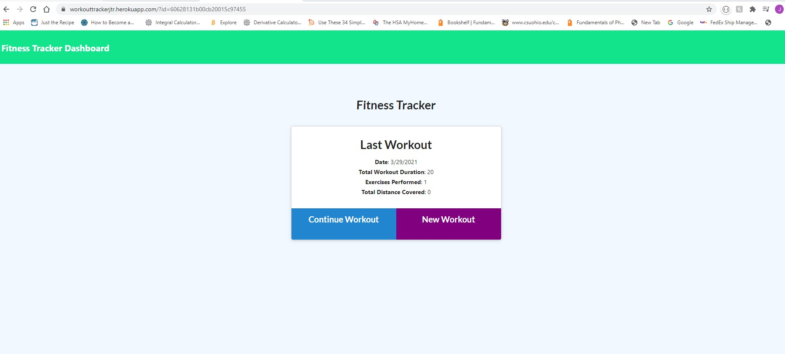
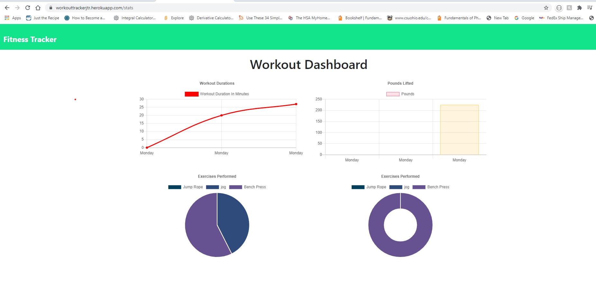

# Workout_Tracker

## Description 

This is a CWRU coding bootcamp homework assignment practicing Node.js, express, the non-sequelized database of MongoDB and Mongoose.  The project tests the students ability to incorporate the NPM mongoose database with a MVC file structure.  The project also incorporates using a model schema to allow the user to create workouts and add them to a dashboard that displays their workout progress.  The project practices the ability to get, post, and put using API routes.  This project utilizes the MVC (Model-View-Controller) file set up.  The project also incorporates the ability to deploy an app onto heroku and use MongoDB Atlas database and Amazon Web Service to host the data.

AS A USER I would like a simple application that I can use to track my workout time and weight to see if I am making progress and getting swole.

## Table of Contents

* [Installation](#installation)

* [Usage](#usage)

* [Contributions](#contributions)

* [Tests](#tests)

* [License](#license)

* [Questions](#questions)

* [Future](#future)

* [Contact](#contact)

## Installation
node.js, MongoDB, NPM express, morgan, mongoose

## Usage
The project is used for trackign ones workout progression: https://workouttrackerjtr.herokuapp.com/

Deployed Site

## Contributions
Jordan Rantucci

## Tests
There are no test procedures for this application.

## License 
none

# Questions
See Contact Section

# Future
In the future I would like to be able to track the workouts longer than a week, perhaps have it set up to store months and see a progress calendar.

# Contact

GitHub username: jordanrantucci and Email address: jordanrantucci@gmail.com
